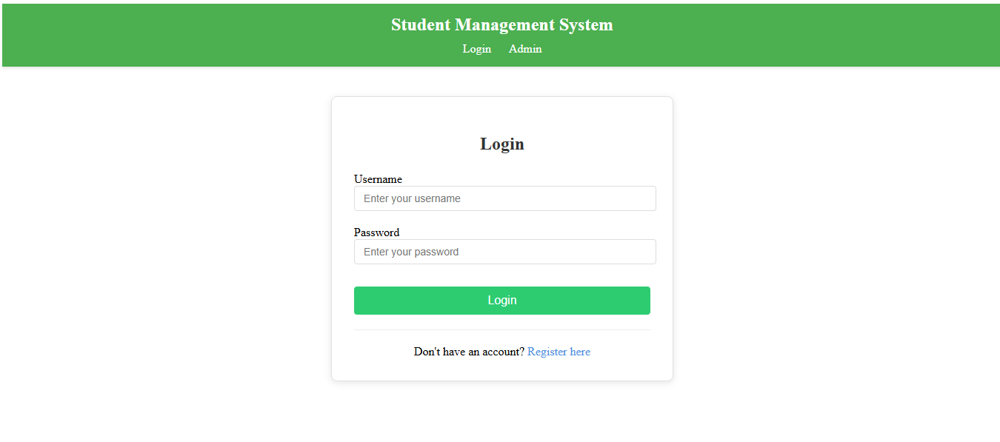

# Student Management System

This is a Student Management System built using ASP.NET Web Forms. It allows administrators to manage students, courses, and other school-related data.

## Features
- Password-protected admin page = "0000"
- Insert, view, and delete students and courses
- User-friendly interface

## Technologies Used
- ASP.NET Web Forms
- C#
- SQL Server (or LocalDB)
- HTML/CSS/JavaScript

## How to Run
1. Clone the repository:
   ```bash
   git clone https://github.com/GamalAsraan/School-Management-System.git
2. Open the project in Visual Studio.
3. Set up the database:
   - Update the connection string in `Web.config` to point to your SQL Server or LocalDB instance.
   - Run the provided SQL scripts to create the necessary tables:
     - `Student`
     - `Course`
     - `StudentCourse`
4. Run the project:
   - Press `F5` or click `Start` in Visual Studio to run the application.

## Admin Access
### Login as Admin
1. Navigate to the Login Page.
2. Enter the following credentials:
   - Username: `admin`
   - Password: `0000` (default).
3. Click `Login`.

### Admin Dashboard
From here, you can:
- Add new courses.
- View and delete courses.
- Manage student records.

### Logout
- Click `Logout` to clear the session and return to the login page.

## Database Schema
### Tables
- **Student**
  - `StudentID` (Primary Key)
  - `FullName`
  - `Email`
  - `Username`
  - `Password`
- **Course**
  - `CourseID` (Primary Key)
  - `CourseName`
  - `Instructor`
  - `Credits`
- **StudentCourse**
  - `StudentID` (Foreign Key)
  - `CourseID` (Foreign Key)
  
## Website Preview

### Login Page


### Sign Up Page


### Admin - Insert Course


### Student - Add Course


### Admin - Delete Course


### Student - Drop Course

