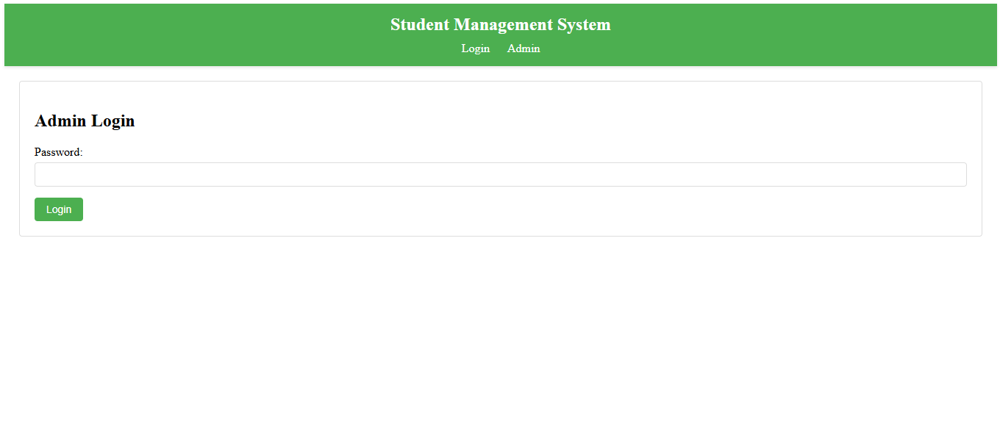

# Student Management System

This is a Student Management System built using ASP.NET Web Forms. It allows administrators to manage students, courses, and other school-related data.

## Features
- Password-protected admin page = "0000".
- Insert, view, and delete students and courses.
- User-friendly interface.

## Technologies Used
- ASP.NET Web Forms
- C#
- SQL Server (or LocalDB)
- HTML/CSS/JavaScript

## How to Run
1. Clone the repository.
2. Open the project in Visual Studio.
3. Set up the database (update the connection string in `Web.config`).
4. Run the project.
<<<<<<< HEAD

## Website Preview

### Login Page

### Sign Up Page

### Admin Login

### Admin - Insert Course

### Student - Add Course

### Admin - Delete Course

### Student - Drop Course

